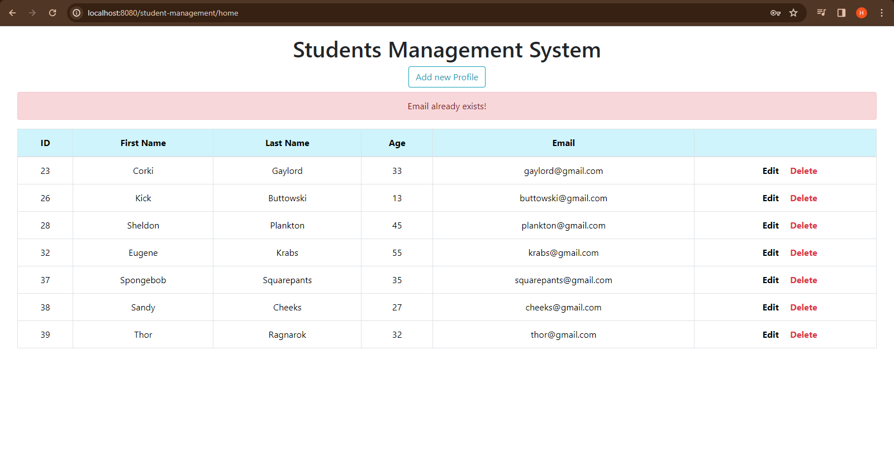
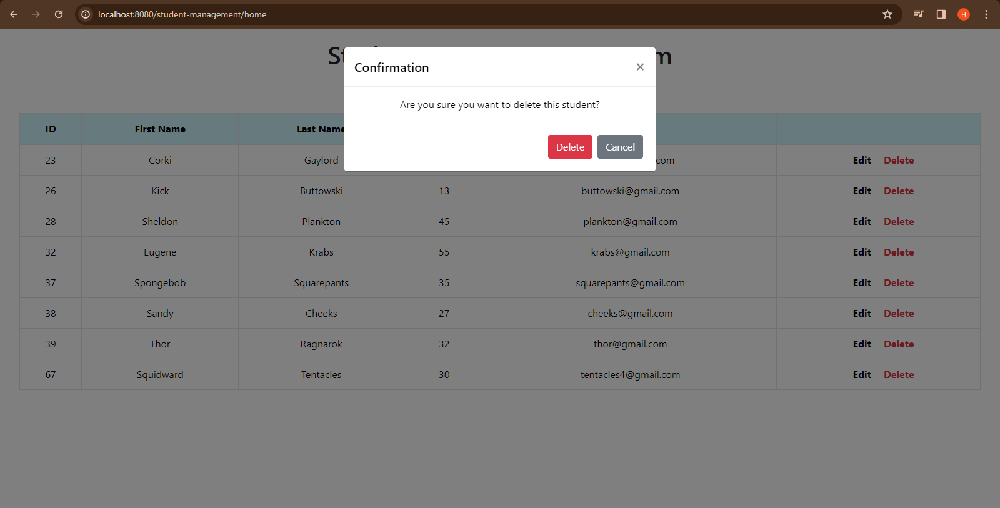

# Student Management System

The endpoint of this page is `/student-management/home` showing the
basic information of students such as `ID`,  `First Name`, `Last Name`, `Age` and `Email`.

It also contains buttons for ***revision*** like `Add new Profile`, `Edit`, and `Delete`.

$~$
## Adding New Student

The `Add new Profile` with an endpoint of `/student-management/create-student` lets you create new student to the list.

| Field      | Type         | Null | Key | Default | Extra          |
|------------|--------------|------|-----|---------|----------------|
| ID         | bigint       | NO   | PRI | NULL    | auto_increment |
| Age        | int          | NO   |     | NULL    |                |
| Email      | varchar(255) | NO   | UNI | NULL    |                |
| First Name | varchar(255) | NO   |     | NULL    |                |
| Last Name  | varchar(255) | NO   |     | NULL    |                |
| Password   | varchar(255) | NO   |     | NULL    |                |

$~$

The program throws an `error` if the password didn't match.

$~$

Throws an `EmailAlreadyExistException` if email already used.

$~$

Shows a `success` message if student successfully saved.

$~$
## Editing Student

The `Edit` page display the student `ID`, `First Name`, `Last Name`, `Age`, and `Email`

$~$
## Deleting Student

